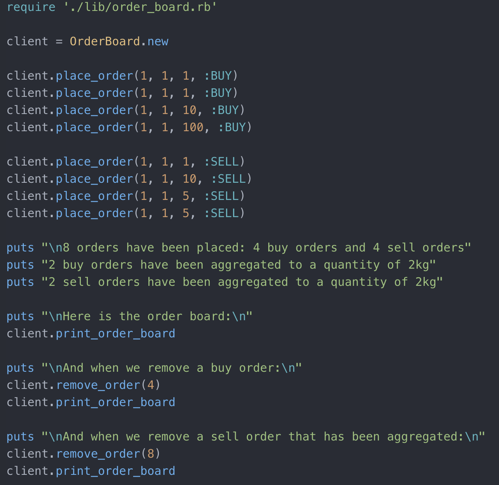
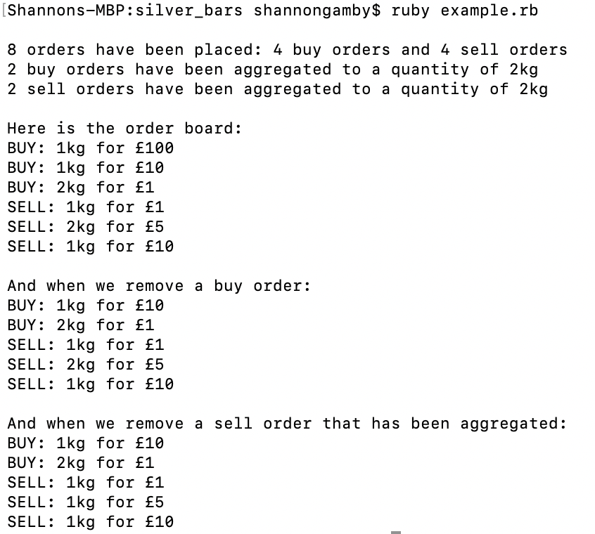

# Silver Bars Tech Test
This is a command line app in which users can place buy/sell orders (for silver bars) and print a live order board to the terminal in order to see a summary of orders.
- Written in Ruby, tested with RSpec.

## Setting Up
- Clone this repo and run `bundle install` to install dependencies.
- Use `rspec` to run unit and feature tests. This will also show test coverage.

## Interacting on the command line
- To start interacting:
```
$ require './lib/order_board.rb'
$ client = OrderBoard.new
```
- Placing an order requires the user to input their **user ID**, **quantity**, **price**, and **order type**.
- When the order has been placed, an order object will be returned with an **order ID**.
```
$ client.place_order(1, 1, 1, :BUY)
=> #<Order:0x00007fc3fc9ce7b8 @user_id=1, @quantity=1, @price=1, @type=:BUY, @order_id=1>
```
- The order ID can be used to remove orders:
```
$ client.remove_order(1)
```
- To print the board use:
```
$ client.print_order_board 
```

## Design Choices
### Classes
- **OrderBoard** is the top level class; this is where all the methods for interacting with the application exist. I modelled this class as though it were an API controller. I instantiated the Order object in this class because it would be unmaintainable to pass unstructured data directly out of the controller (for instance, if there were classes in the service layer that needed to manipulate the data before it was passed to the repo class; it would be better to manipulate data objects rather than unstructured data).
  
- **Order** is a data class. Each Order object will have the fields `user_id`, `quantity`, `price`, `type`, and `order_id`.
  
- **LiveOrders** behaves as my repository class and therefore is responsible for adding and deleting Order objects from the `@orders` array and getting Order objects by ID and type. The `@orders` array and the function `generate_order_ID` I wouldn't ordinarily put on a repo class, but since I don't have a database, I've kept them on here (usually, the database would handle generating a unique Order ID for me).
  
- **BoardDisplay** is responsible for printing the board of aggregated orders.
  
- **Aggregator** and **Sorter** could have been methods on the BoardDisplay class. However, I chose to have them as two separate classes so that BoardDisplay could be configured from the outside. This way I can change the behaviour of BoardDisplay in the future by feeding in different aggregators/sorters rather than changing the code in the BoardDisplay class itself. 

### Introduction of an Order ID
In order to cancel an order, each order must be uniquely identifiable. So, on my repo class, (**LiveOrders**), there is a `generate_order_id` function, which will give each order an unique ID.

### Storing Orders
I chose to store the buy and sell orders in a single array. If I was storing them on a database, I would store them in a single table because they are of the same class. This also made it simpler to make sure every order had a unique Order ID. 

### Improvements
If I had more time I would make an OrderFactory class whose responsibility it would be to create Order objects.

## Demonstration
This is the code in `example.rb`:
  

  
    
Running `ruby example.rb` will produce the following output:
  


